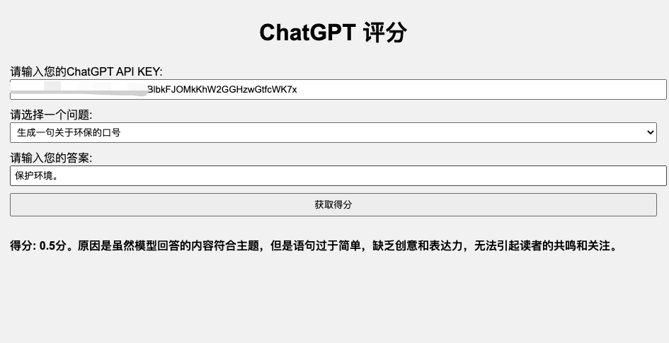

# 中文测试集

*Read this in [English](README_en.md).*

中文测试集包含由BELLE项目产生的不同指令类型、不同领域的测试集，总共有12个指令类型。

## 核心测试集 eval_set.json

其中包含1k+测试集，其中涵盖多个类别。需要说明的是，该测试集是本项目中的相关论文中的测试集的一个子集。
请注意，有一些类型的问题，例如generation，rewrite，brainstorming，不需要标准答案，所以std_answer为空。


测试集使用统一的字段：
```
question: 指令
class: 类型
std_answer: 标准答案
```

样例如下：
```
{
  "question": "将以下句子翻译成英语:我想学一门新语言，法语听起来很有趣。",
  "class": "translation",
  "std_answer": "I want to learn a new language and French sounds interesting."
}
```

## 测试指令 eval_prompt.json

其中包含针对每一个类别的测试数据所对应的prompt，通过该类prompt整合eval_set.json中的测试用例，调用ChatGPT或者GPT-4得到评分结果。

字段如下：
```
class: 类型
prompt: 测试prompt
demo_input_1: 输入样例1
demo_output_1: 输出样例1
demo_input_2: 输入样例2
demo_output_2: 输出样例2
```

样例如下：
```
{
    "class": "translation", 
    "prompt": "假设你是一个语言学家，你需要通过参考标准答案，来对模型的答案给出分数，满分为1分，最低分为0分。请按照\"得分:\"这样的形式输出分数。评价标准要求翻译过后的句子保持原有的意思，并且翻译过后的句子越通顺分数越高。",
    "demo_input_1": "假设你是一个语言学家，你需要通过参考标准答案，来对模型的答案给出分数，满分为1分，最低分为0分。请按照\"得分:\"这样的形式输出分数。评价标准要求翻译过后的句子保持原有的意思，并且翻译过后的句子越通顺分数越高。问题:将以下句子翻译成法语:“I like to take a walk in the evening.” 标准回答: J'aime me promener le soir。 模型回答:J'aime me promener le soir. (注：法语中“le soir”意为“晚上”)。", 
    "demo_output_1": "得分: 1分。模型回答与标准答案完全一致，翻译准确无误。",
    "demo_input_2": "假设你是一个语言学家，你需要通过参考标准答案，来对模型的答案给出分数，满分为1分，最低分为0分。请按照\"得分:\"这样的形式输出分数。评价标准要求翻译过后的句子保持原有的意思，并且翻译过后的句子越通顺分数越高。问题:将以下句子翻译成法语:“I like to take a walk in the evening.” 标准回答: J'aime me promener le soir。模型回答:J'aime me promener le soir。",
    "demo_output_2": "得分:1分。模型回答与标准回答完全一致，翻译准确无误。"
}
```

## 使用ChatGPT自动打分小工具

使用eval_set.json和eval_prompt.json文件，运行下面代码生成ChatGPT评估html文件“ChatGPT_Score.html”
大家可以按照对应数据格式在eval_set.json中增加测试用例，或者修改eval_prompt中的测试prompt

```shell
python generation_html.py 
```
感谢GPT4，这个html是在GPT4的帮助下完成的代码工作。

使用浏览器打开ChatGPT_Score.html。使用时，有以下几个注意点：

1）请输入您的API_KEY，保证能正常访问openai的服务。

2）然后请选择问题，每一次选择问题后，会默认复制到您的剪切板，从而方便去调用其他模型得到回答。

3）输入你的回答，点击“获取得分”等待返回ChatGPT的得分。


