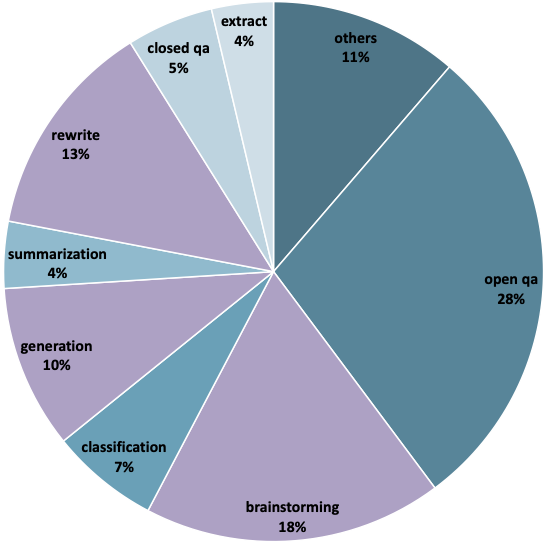
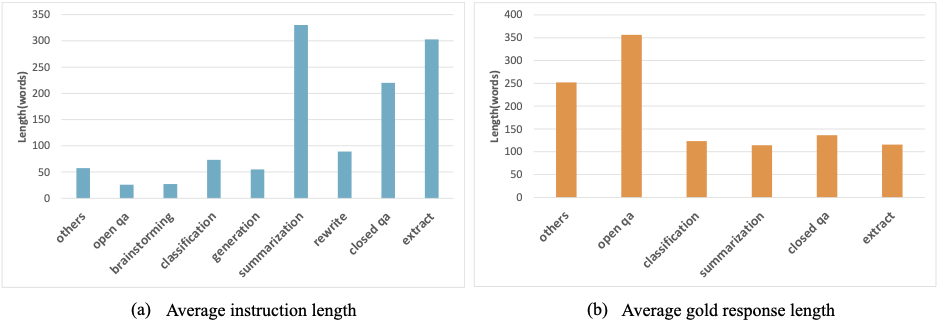

# The Chinese eval set

*[中文README](README.md).*

The Chinese test set contains test sets of different instruction types and domains generated by the BELLE project, totaling 12 instruction types. In our two papers, [Towards Better Instruction Following Language Models for Chinese: Investigating the Impact of Training Data and Evaluation](https://github.com/LianjiaTech/BELLE/blob/main/docs/Towards%20Better%20Instruction%20Following%20Language%20Models%20for%20Chinese.pdf) and [A Comparative Study between Full-Parameter and LoRA-based Fine-Tuning on Chinese Instruction Data for Instruction Following Large Language Model](https://github.com/LianjiaTech/BELLE/blob/main/docs/A%20Comparative%20Study%20between%20Full-Parameter%20and%20LoRA-based.pdf), We have reclassified the tasks of mathematics and code as "other" category. The main reason is that mathematics can be considered as a subcategory of QA in some aspects, and code can be considered as a subcategory of generation. However, considering that these two categories require strong capabilities in COT and have obvious differences from other categories, we have classified math and code as "other" category in our paper.


We conducted relevant data analysis on the eval set, including category distribution, word length of instructions in each category, and word distribution of instructions (we removed some words such as "问题" and "句子").

<p align="center">


</p>
<p align="center">

</p>

## eval_set.json

The test set includes over 1,000 test cases covering multiple categories. It should be noted that this test set is a subset of the test set mentioned in the related paper of this project.

Please note that for some types of questions, such as generation,rewrite,brainstorming, there is no need for a standard answer, and in these cases, the std_answer field is empty.

The test set uses unified fields:
```
question: question or instruction
class: the instruction types, such as generation, classification
std_answer: the standard answer. In some case, it may be empty
```

The example:
```
{
  "question": "将以下句子翻译成英语:我想学一门新语言，法语听起来很有趣。",
  "class": "translation",
  "std_answer": "I want to learn a new language and French sounds interesting."
}
```

## eval_prompt.json

It includes prompts corresponding to the test data for each category, and the eval_set.json test cases are integrated through the corresponding prompts for each category. The evaluation scores are obtained by calling ChatGPT or GPT-4.


The core field:
```
class: the instruction types, such as generation, classification
prompt: evaluate prompt for geting the score

```

The example:
```
{
    "class": "translation", 
    "prompt": "假设你是一个语言学家，你需要通过参考标准答案，来对模型的答案给出分数，满分为1分，最低分为0分。请按照\"得分:\"这样的形式输出分数。评价标准要求翻译过后的句子保持原有的意思，并且翻译过后的句子越通顺分数越高。",

}
```

## Using ChatGPT for automatic scoring

Using the eval_set.json and eval_prompt.json files, run the following code to generate the ChatGPT evaluation HTML file "ChatGPT_Score.html".
You can add test cases to eval_set.json according to the corresponding data format, or modify the test prompts in eval_prompt.

```shell
python generation_html.py 
```

Thanks, GPT-4. This HTML file was generated with the help of the code written using GPT-4.

Open the ChatGPT_Score.html file in your browser. When using it, please note the following:

* Enter your API_KEY to ensure that you can access OpenAI's services.

* Select a question. After each selection, it will be automatically copied to your clipboard, making it easier to call other models for answers.

* Enter your response, click "Get Score", and wait for the score from ChatGPT to be returned.


