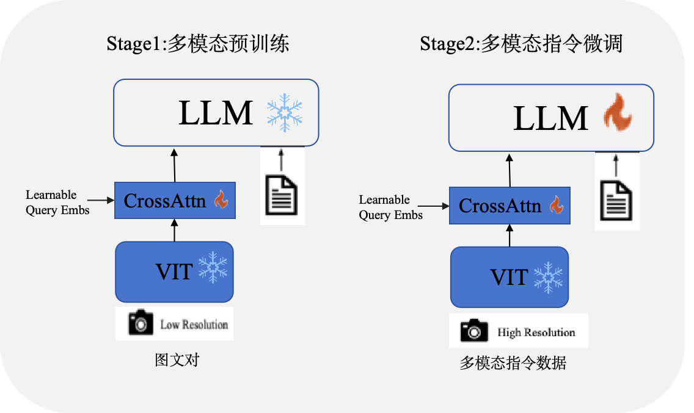

## 📝Belle-VL

### 背景介绍
社区目前已经有很多多模态大语言模型相关开源工作，但大多以英文能力为主，比如[LLava](https://github.com/haotian-liu/LLaVA),[CogVLM](https://github.com/THUDM/CogVLM)等，而中文多模态大语言模型比如[VisualGLM-6B](https://github.com/THUDM/VisualGLM-6B)、[Qwen-VL](https://github.com/QwenLM/Qwen-VL)的语言模型基座均较小，实际应用中很难兼顾视觉和语言能力，因此Belle-VL选择基于更强的语言模型基座来扩展模型的视觉能力，为社区提供更加灵活的选择。

### 模型简介
在模型结构方面，我们主要参考的Qwen-VL 模型，原始Qwen-VL是基于Qwen7B模型训练而来，基座能力相对较弱，因此Belle-VL将语言模型扩展成了Qwen14B-chat，在中文语言能力和视觉能力方面可以兼顾，具备更好的扩展性。

### 训练策略
原始Qwen-vl采用了三阶段的训练方式,包括预训练、多任务训练和指令微调，依赖较大的数据和机器资源。受LLava1.5的启发，多模态指令微调比预训练更加重要，因此我们采用了两阶段的训练方式，如下图所示：

### 训练数据
* 预训练数据：预训练数据主要是基于LLava 的[558k](https://huggingface.co/datasets/liuhaotian/LLaVA-Pretrain)英文指令数据及其对应的中文翻译数据，此外我们还收集了[Flickr30k-CNA](https://zero.so.com/) 以及从[AI Challenger](https://tianchi.aliyun.com/dataset/145781?spm=a2c22.12282016.0.0.5c823721PG2nBW)随机选取的100k数据

* 多模态指令数据：指令微调阶段，数据主要来自[LLava](https://github.com/haotian-liu/LLaVA), [LRV-Instruction](https://github.com/FuxiaoLiu/LRV-Instruction), [LLaVAR](https://github.com/SALT-NLP/LLaVAR),[LVIS-INSTRUCT4V](https://github.com/X2FD/LVIS-INSTRUCT4V)等开源项目，我们也对其中部分数据进行了翻译，在此真诚的感谢他们为开源所做出的贡献！

### [MME Benchmark](https://github.com/BradyFU/Awesome-Multimodal-Large-Language-Models/tree/Evaluation)
待更新
