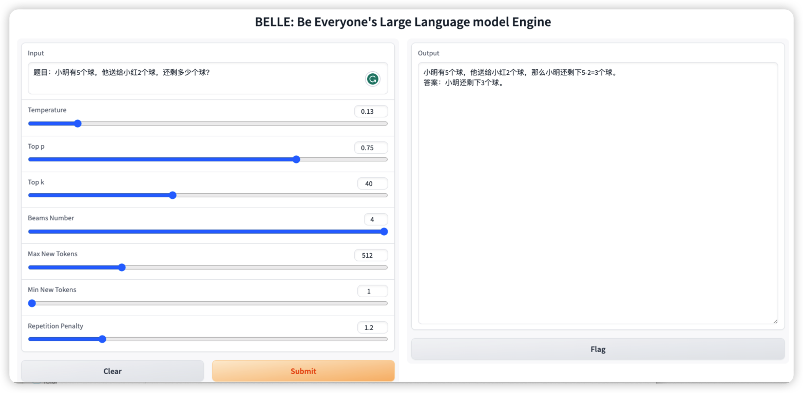

# BELLE微调流程
## 1. Run
### 1.1 数据

#### 1.1.1 指令微调（SFT）
##### 1.1.1.1 Download data

```bash
wget https://huggingface.co/datasets/BelleGroup/school_math_0.25M/resolve/main/school_math_0.25M.json
```

该数据是数学应用题求解任务，包含解题过程，共计约25万条。示例：

| Instruction                                                                                     | Answer                                                                                                                                                                                                                                  |
| ----------------------------------------------------------------------------------------------- | --------------------------------------------------------------------------------------------------------------------------------------------------------------------------------------------------------------------------------------- |
| 一箱鸡蛋有25个，小明爸爸每天给他9个鸡蛋吃，那么一箱鸡蛋能够供小明吃几天？                       | 一箱鸡蛋有25个，小明每天吃9个鸡蛋，用除法计算一下即可： 25 ÷ 9 = 2余7 也就是说，小明第1天到第2天共吃2个鸡蛋，第3天吃剩下的7个鸡蛋。 因此，一箱鸡蛋能够供小明吃2天。                                                                    |
| 小明手中有15颗糖果，他想要分给他的朋友小红和小李，每人分得的糖果数是3颗，那么他还剩下几颗糖果？ | 该题可以用减法来解决。小明手中有15颗糖果，每人分得3颗，所以小红和小李一共分得6颗糖果（3+3=6）。 2. 然后再用原来的糖果总数减去分给小红和小李的糖果数，即可得到小明手中剩余的糖果数。 计算过程如下： 15 - 6 = 9 所以，小明还剩下9颗糖果。 |

##### 1.1.1.2 Convert data format

```bash
python scripts/convert_to_conv_data.py --orig_data school_math_0.25M.json --write_data school_math_0.25M_conv.json --dataset_name bellemath
head -n 1000 school_math_0.25M_conv.json > belleMath-dev1K.json
tail -n +1001 school_math_0.25M_conv.json > belleMath.json
```

我们选取前1000条作为验证集，其余数据作为训练集

**注：**目前仓库的代码要兼容单轮和多轮数据，因此对于之前的开源数据(格式为[instruction,output]，目前绝大部分开源的单轮instruction数据均为这种格式)，需要用convert_to_conv_data.py脚本转换为如下的统一格式:

```bash
{"id": "bellemath42", "conversations": [{"from": "human", "value": " 一箱鸡蛋有25个，小明爸爸每天给他9个鸡蛋吃，那么一箱鸡蛋能够供小明吃几天？"}, {"from": "assistant", "value": "\n一箱鸡蛋有25个，小明每天吃9个鸡蛋，用除法计算一下即可：\n25 ÷ 9 = 2余7\n也就是说，小明第1天到第2天共吃2个鸡蛋，第3天吃剩下的7个鸡蛋。\n因此，一箱鸡蛋能够供小明吃2天。"}]}
{"id": "bellemath80", "conversations": [{"from": "human", "value": "小明手中有15颗糖果，他想要分给他的朋友小红和小李，每人分得的糖果数是3颗，那么他还剩下几颗糖果？"}, {"from": "assistant", "value": " \n1. 该题可以用减法来解决。小明手中有15颗糖果，每人分得3颗，所以小红和小李一共分得6颗糖果（3+3=6）。\n2. 然后再用原来的糖果总数减去分给小红和小李的糖果数，即可得到小明手中剩余的糖果数。 \n计算过程如下：\n15 - 6 = 9\n所以，小明还剩下9颗糖果。"}]}
```

其他的训练数据见：https://huggingface.co/BelleGroup  按照上述流程转换格式即可。

对于多轮对话数据， [shareGPT](https://huggingface.co/datasets/anon8231489123/ShareGPT_Vicuna_unfiltered/tree/main) 是一个开源的大规模多轮对话数据，具体效果可参考我们的工作：[Towards Better Instruction Following Language Models for Chinese: Investigating the Impact of Training Data and Evaluation](https://arxiv.org/pdf/2304.07854.pdf)

当前代码已支持训练这种多轮对话数据。数据下载：

```bash
wget https://huggingface.co/datasets/anon8231489123/ShareGPT_Vicuna_unfiltered/resolve/main/ShareGPT_V3_unfiltered_cleaned_split.json
```

#### 1.1.2 继续预训练（PT）
数据格式
```
{"text": xxx}
{"text": xxx}
```

### 1.2 模型训练

支持配置

* 全量微调 + Deepspeed
* LoRA + Deepspeed
* LoRA + int8

训练的启动脚本写在`scripts/run_<pt|sft>.sh`，你需要按照实际需求修改`run_<pt|sft>.sh`中的参数。

`run_pt.sh`实现了继续预训练，`run_sft.sh`实现了指令微调。

```bash
bash scripts/run_sft.sh
```

- model_name_or_path 代表预训练模型（如果是LLaMA模型，需事先转为hf格式才能通过from_pretrained读取）
- train_file 代表训练数据
- validation_file 代表验证数据
- output_dir 代表训练日志和模型保存的路径
- cache_dir 代表缓存数据处理过程的路径
- cutoff_len 代表最长输入序列长度（LLaMA模型建议设置为1024以上，Bloom模型设置为512以上）

`run_<pt|sft>.sh`中包含了全量参数微调和LoRA两种训练方式的启动命令，这里将简单说明下启动命令中各个参数的含义

**模型resume from checkpoint**

如果`output_dir`包含了多个存档点，训练直接从最新的存档点恢复，也可以`--resume_from_checkpoint ${output_dir}/checkpoint-xxx`手动指定从step xxx恢复

**Flash Attention**

flash attention实现了高效利用显存的attention，可支持更大的序列长度

`run_pt.sh`默认使用flash-attention-v2

`run_sft.sh`flash-attention-v2可选，可通过`--use_flash_attention`打开

#### 1.2.1 全量参数微调

下面的命令是单机多卡进行全量参数微调，同时采用deepspeed，基础模型是LLaMA

```bash
torchrun --nproc_per_node 8 src/entrypoint/sft_train.py \
    --model_name_or_path ${model_name_or_path} \
    --llama \
    --deepspeed configs/deepspeed_config.json \
    --train_file ${train_file} \
    --validation_file ${validation_file} \
    --per_device_train_batch_size 2 \
    --per_device_eval_batch_size 2 \
    --gradient_accumulation_steps 4 \
    --num_train_epochs 2 \
    --model_max_length ${cutoff_len} \
    --save_strategy "steps" \
    --save_total_limit 3 \
    --learning_rate 8e-6 \
    --weight_decay 0.00001 \
    --warmup_ratio 0.05 \
    --lr_scheduler_type "cosine" \
    --logging_steps 10 \
    --evaluation_strategy "steps" \
    --fp16 True \
    --seed 1234 \
    --gradient_checkpointing True \
    --cache_dir ${cache_dir} \
    --output_dir ${output_dir}
```

**参数说明**

1. 如果想要单卡训练，仅需将nproc_per_node设置为1即可
2. 如果预训练模型不是LLaMA，则去掉--llama。如果是LLaMA模型，需要指定--llama。因为LLaMA模型需要采用LLamaTokenizer加载，如果用AutoTokenizer加载llama可能会出现无限递归的问题，这和transformers版本有关
3. 如果运行环境不支持deepspeed，去掉--deepspeed

deepspeed 的参数配置可参考：

1. https://www.deepspeed.ai/docs/config-json/
2. https://huggingface.co/docs/accelerate/usage_guides/deepspeed
3. https://github.com/huggingface/transformers/blob/main/tests/deepspeed

**关于deepspeed**

如果显存充足，可优先考虑stage 2，对应的配置文件是configs/deepspeed_config.json。如果显存不足，可采用stage 3，该模式下模型参数将分布在多张显卡上，可显著减小显存占用，对应的配置文件是configs/deepspeed_config_stage3.json。

训练日志和模型保存在output_dir目录下，目录下的文件结构应该如下：

```Arduino
output_dir/
├── checkpoint-244/
│   ├── pytorch_model.bin
│   ├── config.json
│   └── trainer_state.json
├── checkpoint-527/
│   ├── pytorch_model.bin
│   ├── config.json
│   └── trainer_state.json
├── pytorch_model.bin
├── print_log.txt
└── config.json
```

trainer_state.json记录了loss、learning_rate的变化

#### 1.2.2 LoRA

```bash
torchrun --nproc_per_node 8 src/entry_point/sft_train.py \
    --model_name_or_path ${model_name_or_path} \
    --llama \
    --use_lora True \
    --use_int8_training \
    --lora_config configs/lora_config_llama.json \
    --train_file ${train_file} \
    --validation_file ${validation_file} \
    --per_device_train_batch_size 2 \
    --per_device_eval_batch_size 2 \
    --gradient_accumulation_steps 4 \
    --num_train_epochs 2 \
    --model_max_length ${cutoff_len} \
    --save_strategy "steps" \
    --save_total_limit 3 \
    --learning_rate 8e-6 \
    --weight_decay 0.00001 \
    --warmup_ratio 0.05 \
    --lr_scheduler_type "cosine" \
    --logging_steps 10 \
    --evaluation_strategy "steps" \
    --fp16 True \
    --seed 1234 \
    --gradient_checkpointing True \
    --cache_dir ${cache_dir} \
    --output_dir ${output_dir} \
    # --deepspeed configs/deepspeed_config_stage3.json
```

**参数说明**

* use_lora 代表采用LoRA训练
* use_int8_training 代表采用8bit量化训练，可显著减少显存占用
* lora_config 给出了LoRA的参数配置。如果训练Bloom模型，则改为configs/lora_config_bloom.json
* deepspeed 训练的序列较长时，推荐使用deepspeed stage 3，能有效将模型参数分配到多卡上，留下空间加载更长的序列

**注意**：use_int8_training和deepspeed只能二选一，不可同时使用

output_dir目录的文件结构如下：

```
output_dir/
├── checkpoint-244/
│   ├── pytorch_model.bin
│   └── trainer_state.json
├── checkpoint-527/
│   ├── pytorch_model.bin
│   └── trainer_state.json
├── print_log.txt
└── adapter_config.json
```

最上级目录存储训练的最终模型

#### 1.2.3 合并LoRA权重

如果您想要实现LoRA权重与预训练模型的合并，可运行如下命令：

```bash
bash scripts/merge_lora.sh
```

合并后的权重保存在output_path目录下，后续可通过from_pretrained直接加载

#### 1.2.4 多机多卡训练

以两台机器为例，每台机器上有8张卡

首先需要在第一台机器(主机器)上运行

```bash
bash scripts/multinode_run.sh 0
```

然后在第二台机器上运行

```bash
bash scripts/multinode_run.sh 1
```

**参数说明**

```bash
node_rank=$1
echo ${node_rank}
master_addr="10.111.112.223"

# #Multi-node
torchrun --nproc_per_node 8 --nnodes 2 --master_addr ${master_addr} --master_port 14545 --node_rank ${node_rank} src/train.py 
```

- node_rank 代表节点的rank，第一台机器（主机器）的rank设置为0，第二台机器的rank设置为1
- nnodes 代表节点机器的数量
- master_addr 代表主机器的ip地址
- master_port 代表与主机器通信的端口号

## 2. Inference

### 2.1 Inference

如果您看到了这里，说明您已经完成了训练。现在我们加载训练好的模型，验证模型生成文本的效果。

```bash
CUDA_VISIBLE_DEVICES=0 python src/entry_point/inference.py \
    --model_name_or_path $model_name_or_path \
    --ckpt_path $ckpt_path \
    --llama \
    --use_lora
```

**参数说明：**

- model_name_or_path 是原生预训练模型的路径
- ckpt_path 是训练后保存的模型路径，也就是output_dir
- llama 代表基础模型是否是LLaMA模型
- use_lora 代表ckpt_path是否是LoRA权重

**注：LoRA训练后保存的模型adapter_model.bin有可能是空文件，此时需要将其它checkpoint-step下保存的pytorch_model.bin复制到output_dir目录下**

此外，如果您已经将LoRA权重与预训练模型进行了合并，则ckpt_path指定为合并后权重保存的路径即可，不需要再指定use_lora

### 2.2 webUI

我们也提供了一个简洁的基于gradio的交互式web界面，启动服务：

```bash
CUDA_VISIBLE_DEVICES=0 python src/entry_point/interface.py \
    --model_name_or_path $model_name_or_path \
    --ckpt_path $ckpt_path \
    --llama \
    --use_lora
```
服务访问地址是 hostip:17860



### 2.3 并行推理
```bash
bash scripts/run_multi_backend.sh
```
打开`src/entry_point/evaluation.ipynb`，设置相应路径，加载自己的数据推理

### 2.4 ZeRO Inference
详见[ZeRO Inference](README_ZERO_INFERENCE.md)

## 3. Additional Notes

### 3.1 LLaMA模型的使用

#### 3.1.1 facebook官方LLaMA权重转为hf格式

首先，您需要从[facebookresearch/llama](https://github.com/facebookresearch/llama)获取LLaMA模型的访问权限，下载官方检查点

```bash
python scripts/convert_llama_weights_to_hf.py --input_dir download_official_llama_path --model_size 7B --output_dir xx/llama-7b-hf
```

运行训练脚本时将model_name_or_path改为xx/llama-7b-hf即可

#### 3.1.2 BELLE-LLaMA转为hf格式

由于LLaMA模型的使用约束，我们只能开源与原始模型的diff（如：[BELLE-LLaMA-7B-2M-enc](https://huggingface.co/BelleGroup/BELLE-LLaMA-7B-2M-enc)）。当您已经从[facebookresearch/llama](https://github.com/facebookresearch/llama)获取LLaMA模型的访问权限后，可参考 https://github.com/LianjiaTech/BELLE/tree/main/models ，转换后的模型即为我们指令调优后的LLaMA模型。

### 3.2 合并词表

如果您想在原版LLaMA的基础上扩充中文词表，可参考scripts/merge_tokenizers.py，后续会开放训练embedding的代码。扩充词表后的效果可参考我们的工作：[Towards Better Instruction Following Language Models for Chinese: Investigating the Impact of Training Data and Evaluation](https://arxiv.org/pdf/2304.07854.pdf)

## 4. 问题反馈

如有问题，请在GitHub Issue中提交。在遇到问题前，请先在 [FAQ](https://github.com/LianjiaTech/BELLE/blob/main/train/docs/FAQ.md) 中查找相似问题的解决方案。
